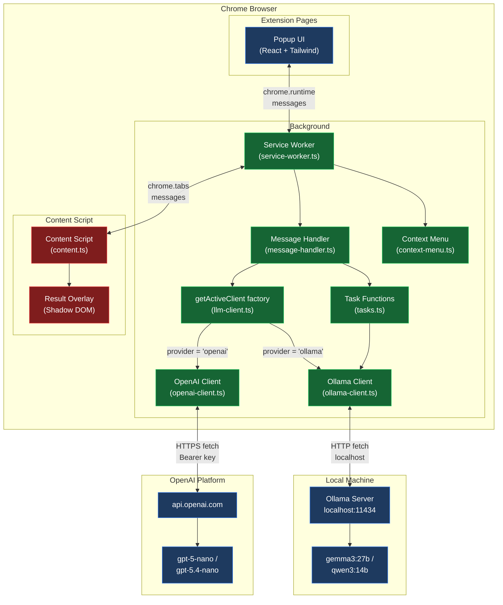
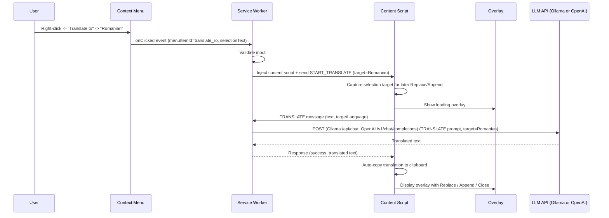
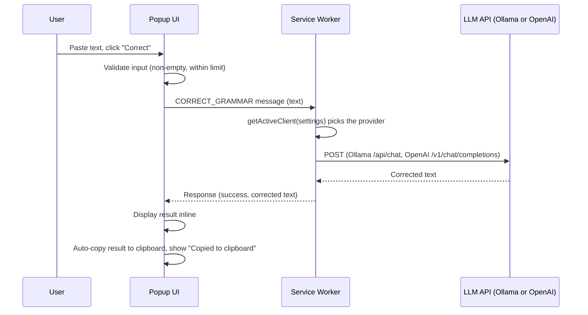
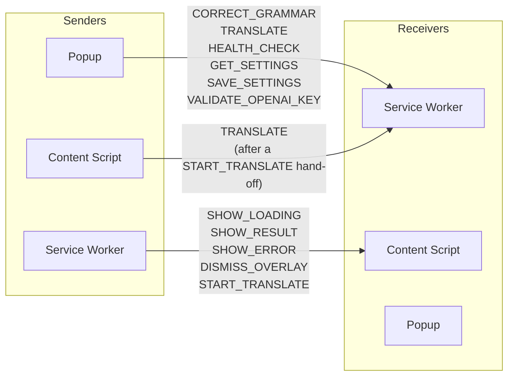
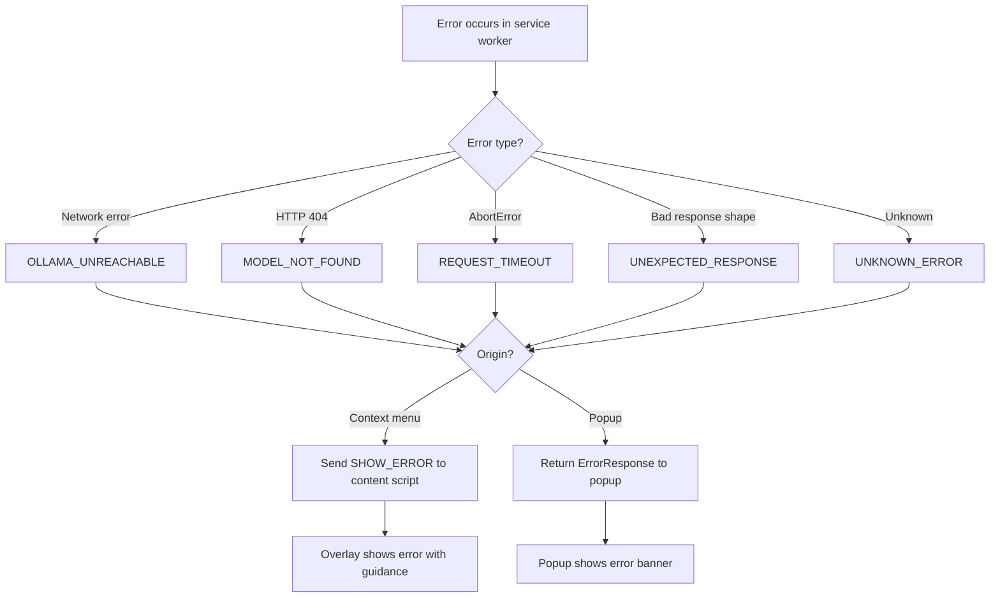
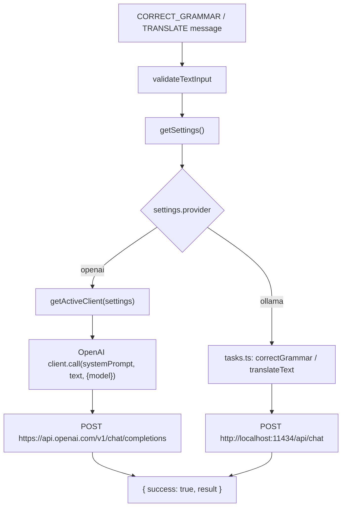

# Architecture Document -- Correct & Translate Chrome Extension

**Date**: 2026-05-20
**Author**: chrome-extension-architect
**Version**: 1.1
**Status**: IMPLEMENTED -- reflects extension v1.7.0 / `main` as of 2026-06-12

---

## Table of Contents

1. [Architecture Overview](#1-architecture-overview)
2. [Component Breakdown](#2-component-breakdown)
3. [Manifest V3 Design](#3-manifest-v3-design)
4. [File and Folder Structure](#4-file-and-folder-structure)
5. [Data Flow Diagram](#5-data-flow-diagram)
6. [Message Flow and Typed Contracts](#6-message-flow-and-typed-contracts)
7. [Storage Model](#7-storage-model)
8. [Context Menu Design](#8-context-menu-design)
9. [Overlay and Result UI Design](#9-overlay-and-result-ui-design)
10. [Error Handling Strategy](#10-error-handling-strategy)
11. [Security Considerations](#11-security-considerations)
12. [Testing Strategy](#12-testing-strategy)
13. [Implementation Checklist](#13-implementation-checklist)
14. [Multi-Provider Architecture (LLM Abstraction)](#14-multi-provider-architecture-llm-abstraction)

---

## Document Revision Note (v1.1)

Version 1.1 reflects the code shipped on the `feat/openai-provider` branch. The
extension now supports two LLM providers behind a common abstraction: the local
**Ollama** provider (default, unchanged behavior) and an online **OpenAI**
provider. The popup and in-page overlay result UI were also revised. Sections
below have been updated where the shipped code differs from the original v1.0
plan; the new multi-provider design is described in full in
[Section 14](#14-multi-provider-architecture-llm-abstraction).

---

## Document Revision Note (v1.2)

Version 1.2 records the changes shipped after v1.1 (merged via PRs #4--#10):

- **Reformulate action.** A third text action alongside Correct and Translate,
  in both the context menu and the popup, with four tones (`keep`,
  `professional`, `friendly`, `natural`) and a persistent **Keep terminology**
  toggle. See `buildReformulateSystemPrompt` (`prompts.ts`), `reformulateText`
  (`tasks.ts`), and the `REFORMULATE` / `START_REFORMULATE` messages.
- **Context menu restructured** under one top-level entry,
  `Correct/Translate/Reformulate`, with `Translate` and `Reformulate` submenus
  and a `Keep terminology` checkbox item (Section 8).
- **Ollama uses the native `/api/chat` endpoint** instead of the
  OpenAI-compatible `/v1/chat/completions`. The latter silently ignored the
  `options` block, leaving `num_ctx`, `temperature`, `top_p`, `top_k` and
  `think` with no effect; the context window is now capped at 16k as intended
  (Section 14.4, Appendix C).
- **Result metadata.** Every result carries the model name, token count and
  elapsed time (`LLMResult`); the overlay and popup render a
  `model - tokens - elapsed` line.
- **`<all_urls>` host permission**, required to inject the content script into
  cross-origin iframes -- webmail compose editors (GMX, etc.) host their editor
  in such a frame, which `activeTab` cannot reach. Network egress is still
  restricted to Ollama and OpenAI by the unchanged `connect-src` CSP
  (Section 3).
- **Frame-targeted injection.** Context-menu actions inject the content script
  into the frame that was right-clicked (`info.frameId`), so selections inside
  iframes are seen (Section 8.4).
- **Rich-editor Replace/Append.** The editor element is re-focused before
  inserting, so `execCommand('insertText')` runs inside it -- managed editors
  (ProseMirror-based: Confluence, Notion) only apply input events when focused.
- **Production packaging.** `scripts/package.sh` (run via `pnpm package`)
  builds `dist/` and zips it into `correct-and-translate-<version>.zip`.

The numbered sections below are updated for the load-bearing facts (manifest,
context menu, Ollama endpoint). Some prose still names only the
Correct/Translate pair -- read it as applying to Reformulate equally.

---

## Document Revision Note (v1.3)

Version 1.3 records the changes shipped through extension **v1.7.0** on `main`:

- **Summarize action.** A fourth text action alongside Correct, Translate, and
  Reformulate, in both the context menu and the popup, with three lengths
  (`brief`, `standard`, `detailed`) and a persistent last-used length
  (`defaultSummarizeLength`, default `standard`). See the `SummarizeLength` type,
  the `SUMMARIZE` / `START_SUMMARIZE` messages, and the `summarize_*` context-menu
  IDs (`summarize_brief`, `summarize_standard`, `summarize_detailed`). The flow
  mirrors Reformulate: the service worker hands off via `START_SUMMARIZE` and the
  content script runs the summarize-and-show-result flow. Where prose below names
  only the Correct/Translate/Reformulate set, read it as applying to Summarize
  equally.
- **Two more languages.** `SupportedLanguage` now includes `Spanish` and
  `Italian` in addition to English, German, and Romanian (`SUPPORTED_LANGUAGES`,
  `LANGUAGE_FLAGS`), exposed as `translate_es` / `translate_it` context-menu
  items.
- **Shipped Ollama default is `gemma3:27b`** (`DEFAULT_MODEL`); `qwen3:14b` is the
  lighter `FALLBACK_MODEL`. Any pulled model remains selectable in the popup.
  (Historical and evaluation references to `qwen3:14b` below describe the
  evaluation, not the current default.)

---

## 1. Architecture Overview

### 1.1 Goals

- Provide grammar/spelling correction and translation (EN, DE, RO) via local Ollama LLM
- Minimal, focused v1 -- no style improvement, reformulation, or default language mode
- Private-use only -- no Chrome Web Store, no telemetry, no cloud
- Secure, maintainable, well-typed codebase

### 1.2 Non-Goals (v1)

- Writing style improvement (v2)
- Sentence reformulation (v2)
- Default language mode (v2)
- Streaming responses (v2)
- Side panel UI
- Cross-browser support
- Chrome Web Store publication
- User accounts or cloud sync

### 1.3 Assumptions

- Ollama runs locally on `http://localhost:11434`
- User's machine: Apple M4 Pro, 48 GB unified memory
- Model `gemma3:27b` (the shipped default) is pulled and available
- Only English, German, Romanian, Spanish, and Italian are supported
- The user understands that LLM inference takes 5-40 seconds depending on model load state

### 1.4 High-Level Architecture Diagram

The extension supports two LLM providers behind a common `LLMClient`
abstraction. Ollama is the default (local, private); OpenAI is an opt-in online
alternative. The service worker remains the only component that makes network
requests, regardless of provider.



**Trust boundary**: The service worker and extension pages are trusted. Content scripts operate in the webpage context and are treated as an untrusted boundary. All data crossing from content scripts to the service worker must be validated.

**Provider boundary**: With Ollama all text stays on the local machine. With OpenAI the selected text leaves the machine over HTTPS to `api.openai.com`. Switching to OpenAI is gated by a one-time consent dialog (see [Section 14](#14-multi-provider-architecture-llm-abstraction) and the [provider setup and privacy guide](provider-setup-and-privacy.md)).

---

## 2. Component Breakdown

### 2.1 Service Worker (`src/background/`)

The service worker is the central hub. It:

- Registers and handles context menu clicks
- Receives messages from the popup and content scripts
- Resolves the active LLM provider via the `getActiveClient` factory and calls
  either the Ollama API or the OpenAI API
- Validates all incoming messages against typed contracts
- Returns results to the requesting component
- Performs health checks against the active provider
- Validates an OpenAI API key on demand (`VALIDATE_OPENAI_KEY`)

The service worker never touches the DOM. It is the only component that makes
network requests -- to local Ollama or to `api.openai.com`. Content scripts and
the popup never call either provider directly.

The background module split is:

| Module | Role |
|--------|------|
| `service-worker.ts` | MV3 entry point; registers context-menu, message, and click listeners |
| `message-handler.ts` | Routes popup messages, validates input, picks the provider path |
| `llm-client.ts` | Defines the provider-agnostic `LLMClient` interface and the `getActiveClient` factory |
| `ollama-client.ts` | Fetch-based Ollama client plus its `LLMClient` adapter |
| `openai-client.ts` | Fetch-based OpenAI client plus its `LLMClient` factory |
| `tasks.ts` | `correctGrammar` / `translateText` helpers (Ollama path) |
| `context-menu.ts` | Context-menu registration and menu-ID to action mapping |

**Lifecycle considerations**: Manifest V3 service workers are ephemeral. They can be terminated after 30 seconds of inactivity. However, active fetch requests and open message channels keep the service worker alive. Since LLM calls can take up to 60 seconds (the `REQUEST_TIMEOUT_MS` value), the service worker will remain alive for the duration of each request. No special keep-alive mechanism is needed for non-streaming calls.

### 2.2 Content Script (`src/content/`)

The content script is injected into web pages when the user invokes an action (via `activeTab` + `scripting`). It:

- Reads the currently selected text from the page
- Receives results from the service worker
- Renders the result overlay using Shadow DOM (isolated styles)
- Auto-copies the result to the clipboard and renders Replace / Append / Close
  actions in the overlay footer (see [Section 9](#9-overlay-and-result-ui-design))
- Drives the translation flow itself after a `START_TRANSLATE` hand-off
- Cleans up the overlay when dismissed

The content script never calls Ollama or OpenAI directly. It only communicates with the service worker via `chrome.runtime.sendMessage` and `chrome.runtime.onMessage`.

**Injection strategy**: The content script is injected programmatically via `chrome.scripting.executeScript` when the user triggers a context menu action. This avoids persistent content script injection on all pages and works with `activeTab` permission.

### 2.3 Popup UI (`src/popup/`)

A React application rendered in the extension popup. It provides:

- **Provider selector**: Choose `Ollama (local)` (default) or `OpenAI`. Switching
  to OpenAI for the first time opens a one-time consent dialog (data egress
  notice). When OpenAI is active, a yellow `OpenAI` badge is shown next to the
  popup title.
- **Settings section**: provider-specific fields --
  - Ollama: endpoint URL and model selector dropdown
  - OpenAI: model selector (`gpt-5.4-nano`, `gpt-5-nano`) and an API key field
    with a `Validate` button
  - Common: default target language
- **Quick action section**: Text input area, action buttons (Correct, Translate),
  target language dropdown
- **Status indicator**: connection status for the active provider (green dot =
  connected and model available, red dot = unreachable, yellow dot = connected
  but model not found)
- **Result panel**: shows the original and result text. The result is copied to
  the clipboard automatically with a brief "Copied to clipboard" confirmation;
  there are no Replace/Append/Copy/Clear buttons.

The popup communicates with the service worker via `chrome.runtime.sendMessage` for settings changes, key validation, and text processing requests. Results from quick actions are displayed inline in the popup (not in an overlay on the page).

The OpenAI API key never reaches the popup in plaintext. `GET_SETTINGS` returns
the key as the sentinel `__SET__` (or `''` when no key is stored); the popup
only learns whether a key is set. The real key is held only in the service
worker and `chrome.storage.local`.

### 2.4 Shared Modules (`src/shared/`)

Shared code used by multiple components:

| Module | Purpose |
|--------|---------|
| `messages.ts` | Typed message interfaces and type guards |
| `storage.ts` | Storage abstraction over `chrome.storage.local`, with defense-in-depth coercion of provider fields |
| `constants.ts` | Shared constants (languages, Ollama and OpenAI defaults, limits) |
| `prompts.ts` | Prompt templates for grammar correction and translation (shared by both providers) |
| `errors.ts` | Error codes, user-facing messages, and the `LLMError` class used by the OpenAI client |
| `validators.ts` | Input validation functions (text length, endpoint URL, model name) |
| `types.ts` | Shared type definitions, including `LLMProvider`, `OpenAIModel`, and the extended `ExtensionSettings` |

---

## 3. Manifest V3 Design

### 3.1 Complete Manifest

This is the manifest as shipped on the `feat/openai-provider` branch
(`public/manifest.json`).

```json
{
  "manifest_version": 3,
  "name": "Correct & Translate",
  "version": "1.7.0",
  "description": "Grammar correction and translation powered by local Ollama LLM.",

  "permissions": [
    "storage",
    "activeTab",
    "contextMenus",
    "scripting",
    "clipboardWrite"
  ],

  "host_permissions": [
    "<all_urls>"
  ],

  "background": {
    "service_worker": "service-worker.js",
    "type": "module"
  },

  "action": {
    "default_popup": "popup.html",
    "default_icon": {
      "16": "icons/icon-16.png",
      "32": "icons/icon-32.png",
      "48": "icons/icon-48.png",
      "128": "icons/icon-128.png"
    }
  },

  "icons": {
    "16": "icons/icon-16.png",
    "32": "icons/icon-32.png",
    "48": "icons/icon-48.png",
    "128": "icons/icon-128.png"
  },

  "content_security_policy": {
    "extension_pages": "script-src 'self'; object-src 'none'; connect-src 'self' http://localhost:11434 https://api.openai.com"
  }
}
```

**Note**: `service_worker` points to the built output (`service-worker.js`); the
Vite build maps `src/background/service-worker.ts` to it. The `description`
field still references Ollama only; this is a known cosmetic mismatch now that
OpenAI is also supported.

### 3.2 Permission Justification Table

| Permission | Type | Justification | Alternatives Considered |
|------------|------|---------------|------------------------|
| `storage` | API | Store user settings: provider choice, Ollama endpoint and model, OpenAI model and API key, consent flag, default target language | None -- required for settings persistence |
| `activeTab` | API | Access the active tab to read selected text and inject the content script when user triggers a context menu action | Retained alongside the `<all_urls>` host permission (see below), which is what actually enables cross-origin iframe injection |
| `contextMenus` | API | Register right-click menu items for "Correct Grammar" and "Translate to" actions | Popup-only UI -- rejected because context menu is a core interaction |
| `scripting` | API | Programmatically inject the content script into the active tab when user triggers an action. Required because we do not declare persistent content scripts | Declarative `content_scripts` in manifest -- rejected because it would inject on every page load, which is unnecessary and wasteful |
| `clipboardWrite` | API | The result panel (popup) and the in-page overlay copy the result to the clipboard automatically without an explicit copy click. `clipboardWrite` guarantees `navigator.clipboard.writeText` succeeds for this programmatic, non-user-gesture write, and authorizes the `document.execCommand('copy')` fallback used when the async Clipboard API is unavailable. | Requiring an explicit copy button (a user gesture) -- rejected because the UX change removed those buttons in favor of automatic copy |
| `<all_urls>` | Host | Lets the service worker call the Ollama (`localhost:11434`) and OpenAI (`api.openai.com`) APIs, and -- critically -- lets `chrome.scripting.executeScript` inject the content script into **cross-origin iframes**. Webmail compose editors (GMX, etc.) host their editable area in a cross-origin frame that `activeTab` cannot reach. Network egress remains restricted to Ollama and OpenAI by the `connect-src` CSP. | Narrow per-origin host permissions (`localhost:11434`, `api.openai.com`) -- shipped in v1.1 but rejected in v1.2 because they cannot cover the arbitrary cross-origin frames of third-party editors |

### 3.3 Permissions NOT Included (and Why)

| Permission | Why Excluded |
|------------|-------------|
| `tabs` | Not needed -- `activeTab` is sufficient; we do not need to enumerate or modify other tabs |
| `sidePanel` | Not in scope |
| `clipboardRead` | The extension only writes to the clipboard, never reads from it |
| `notifications` | Not needed -- errors shown in popup or overlay |
| `webRequest` | No request interception needed |

### 3.4 Why `clipboardWrite` and `https://api.openai.com` Were Added

These two manifest entries were introduced together with the OpenAI provider and
the result-UI changes:

- **`clipboardWrite`** -- The original v1.0 design relied on `navigator.clipboard`
  working in extension contexts without a permission, because copies were
  triggered by an explicit user click. The revised UI removed the Copy/Clear
  buttons from the popup result panel and the Accept/Reject buttons from the
  overlay; the result is now copied **automatically** when it appears. An
  automatic write is not always backed by a user gesture, so `clipboardWrite` is
  declared to keep `navigator.clipboard.writeText` reliable, and it also covers
  the `document.execCommand('copy')` fallback path.
- **`https://api.openai.com`** in both `host_permissions` and the CSP
  `connect-src` -- Required so the service worker can reach the OpenAI API. It
  appears in `host_permissions` so MV3 allows the cross-origin `fetch`, and in
  the `connect-src` directive so the extension's own Content Security Policy
  permits the connection. The Ollama entries (`http://localhost:11434`) remain
  for the local provider; both providers' endpoints are listed explicitly and
  nothing broader is granted.

**v1.2 update:** `host_permissions` was subsequently broadened to `<all_urls>`
so the content script can be injected into cross-origin iframe editors (see the
permission table in Section 3.2). The `connect-src` CSP still lists only
`http://localhost:11434` and `https://api.openai.com`, so network egress is
unchanged -- the broad host permission governs script injection, not which
servers the extension may contact.

---

## 4. File and Folder Structure

```
chrome.correct.and.reformulate.plugin/
+-- docs/
|   +-- architecture.md              # This document
|   +-- meeting-notes-kickoff.md     # Kickoff meeting notes
|   +-- dispatch-plan.md             # Agent dispatch plan
|   +-- ollama-evaluation.md         # Model evaluation results
|
+-- src/
|   +-- background/
|   |   +-- service-worker.ts        # Service worker entry point
|   |   +-- context-menu.ts          # Context menu registration and handlers
|   |   +-- llm-client.ts            # LLMClient interface + getActiveClient factory
|   |   +-- ollama-client.ts         # Ollama API client (fetch-based) + LLMClient adapter
|   |   +-- openai-client.ts         # OpenAI API client (fetch-based) + LLMClient factory
|   |   +-- tasks.ts                 # Task functions (correctGrammar, translateText)
|   |   +-- message-handler.ts       # Message router and dispatcher
|   |
|   +-- content/
|   |   +-- content.ts               # Content script entry point
|   |   +-- overlay.ts               # Result overlay (Shadow DOM)
|   |   +-- overlay.css              # Overlay styles (injected into Shadow DOM)
|   |   +-- text-replacement.ts      # Text replacement in editable fields
|   |
|   +-- popup/
|   |   +-- Popup.tsx                # Root popup component
|   |   +-- components/
|   |   |   +-- StatusIndicator.tsx   # Ollama connection status dot
|   |   |   +-- SettingsSection.tsx   # Settings form (endpoint, model, language)
|   |   |   +-- QuickAction.tsx       # Text input + action buttons
|   |   |   +-- ResultDisplay.tsx     # Inline result display for popup actions
|   |   |   +-- LanguageSelector.tsx  # Language dropdown (reusable)
|   |   +-- popup.css                # Popup-specific Tailwind entry
|   |   +-- main.tsx                 # React mount point
|   |
|   +-- shared/
|   |   +-- messages.ts              # Typed message interfaces and type guards
|   |   +-- storage.ts               # Storage abstraction
|   |   +-- constants.ts             # Languages, defaults, limits
|   |   +-- prompts.ts               # Prompt templates
|   |   +-- errors.ts                # Error types and messages
|   |   +-- validators.ts            # Input validation
|   |   +-- types.ts                 # Shared type definitions
|   |
|   +-- icons/
|       +-- icon-16.png
|       +-- icon-32.png
|       +-- icon-48.png
|       +-- icon-128.png
|
+-- public/
|   +-- popup.html                   # Popup HTML shell
|
+-- tests/
|   +-- unit/
|   |   +-- validators.test.ts
|   |   +-- prompts.test.ts
|   |   +-- messages.test.ts
|   |   +-- storage.test.ts
|   |   +-- ollama-client.test.ts
|   |   +-- tasks.test.ts
|   +-- integration/
|       +-- message-flow.test.ts
|
+-- package.json
+-- pnpm-lock.yaml
+-- tsconfig.json
+-- vite.config.ts
+-- tailwind.config.ts
+-- postcss.config.js
+-- eslint.config.js
+-- .gitignore
+-- README.md
```

---

## 5. Data Flow Diagram

> **Provider routing**: In every flow below, the box labelled "LLM API" is
> resolved at request time by `getActiveClient(settings)`. If
> `settings.provider === 'openai'` the request goes to `api.openai.com`;
> otherwise it goes to local Ollama. The message contracts and the overlay/popup
> UI are identical for both providers. See
> [Section 14](#14-multi-provider-architecture-llm-abstraction) for the
> request/data flow of each client.

### 5.1 Context Menu Flow (Correct Grammar)

```mermaid
sequenceDiagram
    participant User
    participant Page as Web Page
    participant CM as Context Menu
    participant SW as Service Worker
    participant CS as Content Script
    participant OV as Overlay (Shadow DOM)
    participant LLM as LLM API (Ollama or OpenAI)

    User->>Page: Select text on page
    User->>CM: Right-click -> "Correct Grammar"
    CM->>SW: onClicked event (menuItemId, selectionText, tabId)
    SW->>SW: Validate input (non-empty, within 10,000 char limit)
    SW->>CS: Inject content script via chrome.scripting.executeScript
    SW->>CS: Send SHOW_LOADING message
    CS->>CS: Capture selection target for later Replace/Append
    CS->>OV: Show loading overlay near selection
    SW->>LLM: POST (Ollama /api/chat, OpenAI /v1/chat/completions) (GRAMMAR_CORRECT prompt)
    Note over LLM: 5-40 second inference
    LLM-->>SW: Response with corrected text
    SW->>CS: Send SHOW_RESULT message (original, corrected)
    CS->>CS: Auto-copy result to clipboard
    CS->>OV: Display result overlay with Replace / Append / Close
    alt User clicks Replace
        User->>OV: Click Replace
        CS->>Page: Overwrite the captured selection (trailing newline) OR copy to clipboard
        CS->>OV: Remove overlay
    else User clicks Append
        User->>OV: Click Append
        CS->>Page: Insert result after the selection (trailing newline) OR copy to clipboard
        CS->>OV: Remove overlay
    else User clicks Close
        User->>OV: Click Close
        CS->>OV: Remove overlay (no page change; result is still on the clipboard)
    end
```

### 5.2 Context Menu Flow (Translate)

For translation the service worker hands off to the content script via
`START_TRANSLATE`; the content script then runs the translate-and-show-result
flow itself and issues the `TRANSLATE` message. The model auto-detects the
source language during the translation call -- there is no separate detection
step.



### 5.3 Popup Quick Action Flow



---

## 6. Message Flow and Typed Contracts

### 6.1 Message Direction Map



Most context-menu actions originate from `chrome.contextMenus.onClicked` in the
service worker. For **correction**, the service worker drives the
loading -> result sequence. For **translation**, the service worker sends
`START_TRANSLATE` to the content script, which then issues the `TRANSLATE`
message itself and runs the translate-and-show-result flow -- so the content
script does initiate one message type. `VALIDATE_OPENAI_KEY` was added for the
OpenAI provider so the popup can validate a typed key without saving it.

### 6.2 TypeScript Message Interfaces

```typescript
// src/shared/messages.ts

// ============================================================
// Language and Action Types
// ============================================================

export type SupportedLanguage = 'English' | 'German' | 'Romanian' | 'Spanish' | 'Italian';
export type LanguageCode = 'en' | 'de' | 'ro' | 'es' | 'it';
export type ActionType = 'correct' | 'translate' | 'reformulate' | 'summarize';

// ============================================================
// Messages: Popup -> Service Worker
// ============================================================

export interface CorrectGrammarRequest {
  type: 'CORRECT_GRAMMAR';
  payload: {
    text: string;
  };
}

export interface TranslateRequest {
  type: 'TRANSLATE';
  payload: {
    text: string;
    targetLanguage: SupportedLanguage;
  };
}

export interface HealthCheckRequest {
  type: 'HEALTH_CHECK';
}

export interface GetSettingsRequest {
  type: 'GET_SETTINGS';
}

export interface SaveSettingsRequest {
  type: 'SAVE_SETTINGS';
  payload: {
    settings: Partial<ExtensionSettings>;
  };
}

export type PopupToServiceWorkerMessage =
  | CorrectGrammarRequest
  | TranslateRequest
  | HealthCheckRequest
  | GetSettingsRequest
  | SaveSettingsRequest;

// ============================================================
// Messages: Service Worker -> Content Script
// ============================================================

export interface ShowLoadingMessage {
  type: 'SHOW_LOADING';
  payload: {
    action: ActionType;
    originalText: string;
  };
}

export interface ShowResultMessage {
  type: 'SHOW_RESULT';
  payload: {
    action: ActionType;
    originalText: string;
    resultText: string;
    targetLanguage?: SupportedLanguage; // present for translate actions
  };
}

export interface ShowErrorMessage {
  type: 'SHOW_ERROR';
  payload: {
    errorCode: ErrorCode;
    errorMessage: string;
  };
}

export interface DismissOverlayMessage {
  type: 'DISMISS_OVERLAY';
}

export type ServiceWorkerToContentScriptMessage =
  | ShowLoadingMessage
  | ShowResultMessage
  | ShowErrorMessage
  | DismissOverlayMessage;

// ============================================================
// Responses: Service Worker -> Popup
// ============================================================

export interface SuccessResponse {
  success: true;
  result: string;
}

export interface ErrorResponse {
  success: false;
  error: string;
  errorCode: ErrorCode;
}

export interface HealthCheckResponse {
  success: true;
  reachable: boolean;
  modelFound: boolean;
  error: string | null;
}

export interface SettingsResponse {
  success: true;
  settings: ExtensionSettings;
}

export type ServiceWorkerResponse =
  | SuccessResponse
  | ErrorResponse
  | HealthCheckResponse
  | SettingsResponse;

// ============================================================
// Error Codes
// ============================================================

export type ErrorCode =
  | 'OLLAMA_UNREACHABLE'
  | 'MODEL_NOT_FOUND'
  | 'REQUEST_TIMEOUT'
  | 'EMPTY_INPUT'
  | 'INPUT_TOO_LONG'
  | 'INVALID_MESSAGE'
  | 'UNEXPECTED_RESPONSE'
  | 'UNKNOWN_ERROR';

// ============================================================
// Settings (also used by storage model)
// ============================================================

export interface ExtensionSettings {
  ollamaEndpoint: string;
  model: string;
  defaultTargetLanguage: SupportedLanguage;
}

// ============================================================
// Type Guards
// ============================================================

const VALID_TYPES: ReadonlySet<string> = new Set([
  'CORRECT_GRAMMAR',
  'TRANSLATE',
  'HEALTH_CHECK',
  'GET_SETTINGS',
  'SAVE_SETTINGS',
  'SHOW_LOADING',
  'SHOW_RESULT',
  'SHOW_ERROR',
  'DISMISS_OVERLAY',
]);

export function isValidMessageType(type: unknown): type is string {
  return typeof type === 'string' && VALID_TYPES.has(type);
}

export function isCorrectGrammarRequest(msg: unknown): msg is CorrectGrammarRequest {
  return (
    typeof msg === 'object' &&
    msg !== null &&
    (msg as CorrectGrammarRequest).type === 'CORRECT_GRAMMAR' &&
    typeof (msg as CorrectGrammarRequest).payload?.text === 'string'
  );
}

export function isTranslateRequest(msg: unknown): msg is TranslateRequest {
  const m = msg as TranslateRequest;
  return (
    typeof msg === 'object' &&
    msg !== null &&
    m.type === 'TRANSLATE' &&
    typeof m.payload?.text === 'string' &&
    typeof m.payload?.targetLanguage === 'string' &&
    ['English', 'German', 'Romanian', 'Spanish', 'Italian'].includes(m.payload.targetLanguage)
  );
}
```

### 6.3 Message Validation Rules

All messages arriving at the service worker must be validated before processing:

| Check | Rule | On Failure |
|-------|------|------------|
| Message structure | Must have a `type` field that matches a known type | Return `ErrorResponse` with `INVALID_MESSAGE` |
| Text payload | Must be a non-empty string after trimming | Return `ErrorResponse` with `EMPTY_INPUT` |
| Text length | Must be at most 10,000 characters | Return `ErrorResponse` with `INPUT_TOO_LONG` |
| Language values | Must be one of `'English'`, `'German'`, `'Romanian'`, `'Spanish'`, `'Italian'`, or `null` | Return `ErrorResponse` with `INVALID_MESSAGE` |
| Settings payload | Must conform to `Partial<ExtensionSettings>` shape | Return `ErrorResponse` with `INVALID_MESSAGE` |
| Sender origin | For content script messages, verify `sender.tab` is present | Ignore message |

---

## 7. Storage Model

### 7.1 Storage Interface

```typescript
// src/shared/storage.ts (shape; see the file for the full implementation)

export interface StorageSchema {
  settings: ExtensionSettings;
}

// From src/shared/constants.ts
export const DEFAULT_SETTINGS: ExtensionSettings = {
  ollamaEndpoint: 'http://localhost:11434',
  model: 'gemma3:27b',
  defaultTargetLanguage: 'English',
  provider: 'ollama',                  // default provider
  openaiModel: 'gpt-5-nano',
  openaiApiKey: '',                    // empty = not configured
  openaiConsentAcknowledged: false,    // one-time egress consent flag
  keepTerminology: true,               // reformulate: preserve technical terms
  defaultReformulateTone: 'keep',      // reformulate default tone
  defaultSummarizeLength: 'standard',  // summarize default length
};
```

`getSettings()` reads `settings`, merges it over `DEFAULT_SETTINGS`, and then
applies defense-in-depth coercion: an unknown `provider` falls back to
`'ollama'`, an unknown `openaiModel` falls back to `'gpt-5-nano'`, and
non-string / non-boolean key and consent values are reset to their defaults.
This protects against corrupted or hand-edited storage. `saveSettings()` does a
merge (not a replace) so partial updates are safe.

### 7.2 Storage Contents

| Key | Type | Default | Purpose |
|-----|------|---------|---------|
| `settings.ollamaEndpoint` | `string` | `"http://localhost:11434"` | Ollama API base URL |
| `settings.model` | `string` | `"gemma3:27b"` | Active Ollama model name |
| `settings.defaultTargetLanguage` | `SupportedLanguage` | `"English"` | Default target for translations |
| `settings.provider` | `'ollama' \| 'openai'` | `"ollama"` | Active LLM provider |
| `settings.openaiModel` | `'gpt-5.4-nano' \| 'gpt-5-nano'` | `"gpt-5-nano"` | Active OpenAI model |
| `settings.openaiApiKey` | `string` | `""` | OpenAI bearer key; empty means not configured |
| `settings.openaiConsentAcknowledged` | `boolean` | `false` | Set once the user accepts the data-egress consent dialog |

### 7.3 Storage Size Estimate

Total stored data is well under 1 KB even with an OpenAI key. `chrome.storage.local` has a 10 MB limit. No concerns.

### 7.4 Data Sensitivity

The OpenAI API key is the one piece of sensitive data the extension stores.

- The key is stored only in `chrome.storage.local`, which Chrome isolates
  per-extension; no other extension or web page can read it.
- The key never reaches the popup in plaintext: `GET_SETTINGS` redacts it to the
  sentinel `__SET__` (or `''`). The popup only learns whether a key is set.
- The key is never written to a log, an `Error` message, or an error `cause`. It
  is placed only into the `Authorization: Bearer` header at the call site in the
  OpenAI client.
- Raw OpenAI response bodies are never surfaced in user-facing errors, because a
  response can contain account- or request-correlated identifiers.

The extension still does not store:

- User text (processed text is never persisted)
- Personal information
- Browsing history or page content

When the Ollama provider is active, no credential is needed and no text leaves
the machine. The privacy difference between the two providers is documented in
the [provider setup and privacy guide](provider-setup-and-privacy.md).

---

## 8. Context Menu Design

### 8.1 Menu Structure

```
[Right-click on selected text]
|
+-- "Correct/Translate/Reformulate"          (id: "ct_root")
    +-- "Correct Grammar"                    (id: "correct_grammar")
    +-- ----------------                     (separator)
    +-- "Translate to"                       (id: "translate_parent")
    |   +-- "English"                        (id: "translate_en")
    |   +-- "German"                         (id: "translate_de")
    |   +-- "Romanian"                       (id: "translate_ro")
    +-- ----------------                     (separator)
    +-- "Reformulate"                        (id: "reformulate_parent")
    |   +-- "Keep tone"                      (id: "reformulate_keep")
    |   +-- "Professional"                   (id: "reformulate_professional")
    |   +-- "Friendly"                       (id: "reformulate_friendly")
    |   +-- "Natural"                        (id: "reformulate_natural")
    +-- ----------------                     (separator)
    +-- [x] "Keep terminology"               (id: "keep_terminology", checkbox)
```

All items use `contexts: ['selection']`. "Keep terminology" is a checkbox item,
checked by default, whose state is persisted in `chrome.storage` and kept in
sync with the popup's matching toggle.

### 8.2 Registration Code Pattern

`registerContextMenus()` in `src/background/context-menu.ts` is `async`: it
reads `settings.keepTerminology` first (so the checkbox renders with the
correct initial state), then builds the tree under the `ct_root` parent -- the
Correct item, the Translate and Reformulate submenus, the separators, and the
`keep_terminology` checkbox item. It is called from the service worker's
`onInstalled` and `onStartup` handlers. A `chrome.storage.onChanged` listener
calls `chrome.contextMenus.update` to keep the checkbox in sync when
`keepTerminology` is changed from the popup.

### 8.3 Menu Item ID to Action Mapping

| Menu Item ID | Action | Target Language / Tone |
|-------------|--------|------------------------|
| `correct_grammar` | `correct` | N/A |
| `translate_en` / `translate_de` / `translate_ro` | `translate` | English / German / Romanian |
| `reformulate_keep` | `reformulate` | tone `keep` |
| `reformulate_professional` | `reformulate` | tone `professional` |
| `reformulate_friendly` | `reformulate` | tone `friendly` |
| `reformulate_natural` | `reformulate` | tone `natural` |
| `keep_terminology` | (none) | checkbox -- toggles the `keepTerminology` setting |
| `ct_root`, `translate_parent`, `reformulate_parent`, separators | (none) | parent / separator -- no action |

### 8.4 Context Menu Click Handler Flow

1. `chrome.contextMenus.onClicked` fires in the service worker.
2. Extract `info.menuItemId`, `info.selectionText`, `info.frameId`, `tab.id`.
3. If the item is `keep_terminology`, persist the new checkbox state and stop --
   no LLM call, no script injection.
4. Validate `selectionText` is non-empty and within the length limit.
5. Inject the content script into the **frame that was clicked**
   (`executeScript` with `frameIds: [info.frameId]`), so selections inside
   iframes are reachable; all follow-up messages target that same frame.
6. `correct`: send `SHOW_LOADING`, run `correctGrammar`, then send `SHOW_RESULT`
   (or `SHOW_ERROR`).
7. `translate` / `reformulate`: send `START_TRANSLATE` / `START_REFORMULATE` --
   the content script then runs the request-and-render flow itself.

---

## 9. Overlay and Result UI Design

### 9.1 Approach

The result overlay is rendered by the content script using **Shadow DOM** to isolate styles from the host page. This prevents the host page CSS from affecting the overlay and prevents the overlay CSS from leaking into the host page.

### 9.2 Overlay Behavior

The result overlay is **unified** for both correction and translation: the same
panel, the same footer actions, and the same auto-copy behavior apply to both.

| State | Appearance |
|-------|------------|
| **Loading** | Small floating panel near the selection. Contains a spinner animation and the action label ("Correcting..." or "Translating..."). No buttons during loading. |
| **Result** | Panel expands to show the original text (dimmed, smaller) and the result text (prominent). The result is copied to the clipboard automatically and a "Copied to clipboard" hint is shown. Footer actions: **Replace**, **Append**, **Close**. |
| **Error** | Panel shows error message with a warning icon. Dismiss button. Specific guidance text (e.g., "Cannot reach Ollama. Make sure it is running: ollama serve"). |

The previous Accept/Reject pair has been replaced. There is no longer a single
"accept" action; the user explicitly chooses Replace or Append, or dismisses
with Close.

### 9.3 Positioning

1. Get the bounding rectangle of the current text selection using `window.getSelection().getRangeAt(0).getBoundingClientRect()`
2. Position the overlay below the selection, aligned to the left edge
3. If the overlay would extend beyond the viewport bottom, position it above the selection
4. If the overlay would extend beyond the viewport right, align to the right edge instead
5. The overlay has a fixed max-width of 480px and max-height of 320px with scroll for long results

### 9.4 Overlay HTML Structure (inside Shadow DOM)

```
<div class="ct-overlay">                       <!-- root container -->
  <div class="ct-overlay-header">               <!-- action label + close button -->
    <span class="ct-overlay-title">...</span>
    <button class="ct-overlay-close">X</button>
  </div>
  <div class="ct-overlay-body">
    <!-- Loading state -->
    <div class="ct-overlay-loading">
      <div class="ct-spinner"></div>
      <span>Correcting...</span>
    </div>
    <!-- Result state -->
    <div class="ct-overlay-result">
      <div class="ct-original">Original text here</div>
      <div class="ct-result">Result text here</div>
      <div class="ct-copied-hint">Copied to clipboard</div>
    </div>
    <!-- Error state -->
    <div class="ct-overlay-error">
      <span class="ct-error-icon">!</span>
      <span class="ct-error-message">Error message</span>
    </div>
  </div>
  <!-- Result-state footer: Replace, Append, Close -->
  <div class="ct-overlay-actions">
    <button class="ct-btn ct-btn-accept" data-ct-replace>Replace</button>
    <button class="ct-btn ct-btn-secondary" data-ct-append>Append</button>
    <button class="ct-btn ct-btn-dismiss" data-ct-close>Close</button>
  </div>
</div>
```

The error state renders a single `Dismiss` button in `ct-overlay-actions`.

### 9.5 Styling Approach

- All styles scoped inside Shadow DOM -- no global CSS leakage
- CSS class prefix `ct-` (correct-translate) to avoid collisions in the unlikely case of Shadow DOM penetration
- Colors: background `#1e1e2e`, text `#cdd6f4`, accent green `#22c55e`, accent red `#ef4444`, warning yellow `#eab308`
- Font: system font stack (`-apple-system, BlinkMacSystemFont, 'Segoe UI', Roboto, sans-serif`)
- Border radius: 8px
- Box shadow for elevation
- Smooth fade-in animation on appear

### 9.6 Result UI Behavior

The result is copied to the clipboard **automatically** as soon as it appears,
in both the in-page overlay and the popup. The action buttons below only decide
whether and how the result is also written back into the page; the user can
always paste the result regardless of which button (if any) they press.

#### In-page overlay (context menu origin)

When the overlay shows a result, the content script has already captured the
original selection target (an `<input>`/`<textarea>` range or a
`contenteditable` range) at loading time, because interacting with the overlay
can collapse the live selection.

| Action | Behavior |
|--------|----------|
| **Replace** | Overwrite the captured selection with the result text. A trailing newline is appended. If the target is not editable, the result is copied to the clipboard and a "Copied!" toast is shown. Then the overlay closes. |
| **Append** | Insert the result text immediately **after** the captured selection, keeping the original. A trailing newline is appended. If the target is not editable, the result is copied to the clipboard. Then the overlay closes. |
| **Close** | Dismiss the overlay. No page change. The result remains on the clipboard from the automatic copy. |

`<input>`/`<textarea>` writes go through `.value` assignment and dispatch
`input` and `change` events so frameworks pick up the change. `contenteditable`
writes use `document.execCommand('insertText')` (plain text only) with a manual
range fallback.

#### Popup result panel

The popup result panel shows the original and result text and copies the result
to the clipboard automatically, displaying a "Copied to clipboard" confirmation.
It has no Replace/Append/Copy/Clear buttons -- the popup result is informational
plus an automatic clipboard copy. Starting a new action or editing the input
clears the panel.

### 9.7 Keyboard Support

| Key | Action |
|-----|--------|
| `Enter` | Trigger the primary action (Replace) when the overlay is focused |
| `Escape` | Close / dismiss the overlay |
| `Tab` | Move focus between the footer buttons |

The Replace button receives focus when the result overlay opens.

### 9.8 Cleanup

- Only one overlay exists at a time. Creating a new overlay removes any existing one.
- Overlay is removed from the DOM on dismiss.
- All event listeners are removed on cleanup.
- The Shadow DOM host element is removed from `document.body`.

---

## 10. Error Handling Strategy

### 10.1 Error Types and User-Facing Messages

| Error Code | Condition | User-Facing Message | Color |
|------------|-----------|---------------------|-------|
| `OLLAMA_UNREACHABLE` | Ollama server not running or network error | "Cannot reach Ollama. Make sure it is running: `ollama serve`" | Red `#ef4444` |
| `MODEL_NOT_FOUND` | HTTP 404 from Ollama -- model not pulled | "Model not found. Pull it first: `ollama pull gemma3:27b`" | Red `#ef4444` |
| `REQUEST_TIMEOUT` | Provider did not respond within 60 seconds | "Request timed out. The model may be loading. Try again, or switch to a faster model (qwen3:14b) in settings." | Yellow `#eab308` |
| `EMPTY_INPUT` | User submitted empty or whitespace-only text | "No text provided. Select some text first." | Yellow `#eab308` |
| `INPUT_TOO_LONG` | Input exceeds 10,000 characters | "Text is too long (max 10,000 characters). Select a shorter passage." | Yellow `#eab308` |
| `UNEXPECTED_RESPONSE` | Provider returned an unexpected response shape | "Received an unexpected response from Ollama. Check if Ollama is working correctly." | Red `#ef4444` |
| `UNKNOWN_ERROR` | Any unhandled error | "An unexpected error occurred. Check the browser console for details." | Red `#ef4444` |
| `INVALID_MESSAGE` | Malformed message received | "Invalid message received. This is a bug -- please report it." | Red `#ef4444` |
| `OPENAI_AUTH_FAILED` | OpenAI returned HTTP 401 | "OpenAI rejected the API key. Open Settings and check or re-enter your key." | Red `#ef4444` |
| `OPENAI_RATE_LIMITED` | OpenAI returned HTTP 429 (rate limit) | "OpenAI rate limit reached. Wait a few seconds and try again." | Yellow `#eab308` |
| `OPENAI_QUOTA_EXCEEDED` | OpenAI returned HTTP 403, or 429 with `insufficient_quota` | "Your OpenAI account is out of quota or has a billing issue. Check your OpenAI account, or switch back to local Ollama in Settings." | Red `#ef4444` |
| `OPENAI_UNREACHABLE` | Network failure reaching OpenAI | "Cannot reach OpenAI. Check your internet connection, or switch to local Ollama in Settings." | Red `#ef4444` |

The four `OPENAI_*` codes are produced by `openai-client.ts` as structural
`LLMError` instances; `classifyError` reads their `code` directly. The Ollama
client produces plain `Error` objects that `classifyError` maps by message
string. `MODEL_NOT_FOUND`'s message names the configured model (`ollama pull
${model}`); the shipped default is `gemma3:27b`.

### 10.2 Error Flow



### 10.3 Error Handling Principles

1. **Never show raw error objects to users** -- always map to a user-facing message
2. **Always log the full error to the console** for debugging (`console.error` in service worker)
3. **Never include sensitive data in error messages** (no request bodies, no URLs with parameters)
4. **Provide actionable guidance** where possible ("run `ollama serve`", "switch to qwen3:14b")
5. **Use color coding consistently**: red for hard failures, yellow for soft failures or user errors
6. **Timeout errors get yellow** because they are often transient (model loading on first call)
7. **Do not retry automatically** in v1 -- let the user decide

### 10.4 Input Validation (Pre-Request)

Validation happens before any Ollama call:

```typescript
// src/shared/validators.ts

export const MAX_INPUT_LENGTH = 10_000;

export interface ValidationResult {
  valid: boolean;
  errorCode?: ErrorCode;
  errorMessage?: string;
}

export function validateTextInput(text: unknown): ValidationResult {
  if (typeof text !== 'string' || text.trim() === '') {
    return { valid: false, errorCode: 'EMPTY_INPUT', errorMessage: 'No text provided.' };
  }
  if (text.length > MAX_INPUT_LENGTH) {
    return {
      valid: false,
      errorCode: 'INPUT_TOO_LONG',
      errorMessage: `Text is too long (${text.length} characters, max ${MAX_INPUT_LENGTH}).`,
    };
  }
  return { valid: true };
}
```

---

## 11. Security Considerations

### 11.1 Threat Model

| Threat | Description | Severity | Mitigation |
|--------|-------------|----------|------------|
| **T1: Malicious page DOM manipulation** | A malicious webpage could craft DOM content to inject code when the content script reads selection text | Medium | The content script reads `selectionText` from the `chrome.contextMenus.onClicked` info object, which is provided by Chrome, not from `window.getSelection()` directly. For display in the overlay, text is inserted via `textContent`, never `innerHTML`. |
| **T2: Message spoofing from web page** | A webpage could try to send messages to the extension via `chrome.runtime.sendMessage` (externally connectable) | Low | The extension does not declare `externally_connectable` in the manifest. Web pages cannot send messages to the extension. Content script messages are validated by checking `sender.tab`. |
| **T3: Ollama response injection** | Ollama could return text containing HTML/script that gets injected into the page | Medium | All Ollama responses are inserted into the overlay via `textContent` (not `innerHTML`). When replacing text in editable fields, the result is set as plain text value, not HTML. |
| **T4: Content script style leakage** | Overlay CSS could break the host page, or host page CSS could break the overlay | Low | Shadow DOM isolates all overlay styles. Overlay uses a `ct-` prefix for all CSS classes as an additional safeguard. |
| **T5: Localhost SSRF** | The extension calls `localhost:11434`. The `<all_urls>` host permission is broad, so the egress restriction does not come from the host permission | Low | Egress is locked by the `connect-src` CSP to `http://localhost:11434` and `https://api.openai.com` only -- no other endpoint (local or remote) can be reached, regardless of the broad host permission. The service worker is the only component that issues network requests, and the Ollama endpoint string is validated. Narrowing `<all_urls>` is tracked in issue #44. |
| **T6: Storage tampering** | Another extension or malicious code could modify `chrome.storage.local` | Low | `chrome.storage.local` is per-extension and isolated by Chrome. Only this extension can read/write its own storage. Settings are validated on read. |
| **T7: Service worker message validation bypass** | Malformed messages could cause crashes or unexpected behavior | Medium | All messages are validated with type guards before processing. Unknown message types are rejected. Payloads are checked for expected shape and value ranges. |
| **T8: Text replacement in editable fields** | Replacing text in `contenteditable` elements could inject HTML | Medium | Text replacement uses `document.execCommand('insertText')` for `contenteditable` (plain text only) and `.value` assignment for `<textarea>`/`<input>`. Never uses `innerHTML` for replacement. |

### 11.2 Content Security Policy

```json
{
  "content_security_policy": {
    "extension_pages": "script-src 'self'; object-src 'none'; connect-src 'self' http://localhost:11434 https://api.openai.com"
  }
}
```

- `script-src 'self'` -- only scripts from the extension bundle can execute. No inline scripts, no `eval`, no remote scripts.
- `object-src 'none'` -- no plugins (Flash, Java, etc.)
- `connect-src 'self' http://localhost:11434 https://api.openai.com` -- network requests only to the extension itself, local Ollama, and the OpenAI API. `host_permissions` is the broad `<all_urls>` (needed for content-script injection into cross-origin iframes, not for egress), so this `connect-src` directive is the sole egress lock: no provider or endpoint can be reached unless it is listed here. Narrowing `<all_urls>` is tracked in issue #44.

### 11.2.1 OpenAI API Key Handling

The OpenAI provider introduces the only secret the extension handles. The
`openai-client.ts` module enforces these invariants and they are never relaxed:

- The key is read from `chrome.storage.local` by the service worker and placed
  only into the `Authorization: Bearer` header at the call site.
- The key is never logged, never placed in an `Error` message or `cause`, and
  never returned to the popup. `GET_SETTINGS` redacts it to `__SET__`.
- `SAVE_SETTINGS` treats the `__SET__` sentinel as "do not overwrite", so the
  popup can save other settings without ever round-tripping the real key.
- Raw OpenAI response bodies are never surfaced to the user; only sanitized
  messages and HTTP status codes are. This is enforced because an OpenAI
  response (including a `429` body) can contain account- or request-correlated
  identifiers.
- The OpenAI client uses the structural `LLMError` class (carrying an
  `ErrorCode`) instead of string-matching error messages, so classification
  cannot accidentally leak body content.

### 11.3 DOM Safety Rules

1. **Never use `innerHTML`** to insert user text or Ollama responses. Always use `textContent` or `createTextNode`.
2. **Never use `eval`** or `new Function`.
3. **Never use `document.write`**.
4. **Overlay DOM is inside Shadow DOM** -- isolated from the host page.
5. **Text replacement** in editable fields uses safe methods (`insertText` command or `.value` assignment).

### 11.4 Message Validation Rules

1. Every message entering the service worker is validated against typed contracts.
2. Unknown message types are rejected with an error response (not silently dropped).
3. Text payloads are trimmed and length-checked.
4. Language values are checked against the allowed set.
5. Settings payloads are validated field-by-field; invalid fields are silently ignored.

### 11.5 Network Safety

1. The service worker is the only component that makes network requests, for
   either provider.
2. Content scripts never call `fetch` or `XMLHttpRequest`.
3. The popup never calls `fetch` directly -- it communicates through the service worker.
4. Ollama requests go to the configured endpoint (default `http://localhost:11434`),
   which is the only `http://` origin the `connect-src` CSP permits (egress is
   locked by the CSP, not by the broad `<all_urls>` host permission).
5. OpenAI requests go only to `https://api.openai.com`, which is hard-coded as
   `OPENAI_API_BASE` and matched by the `https://api.openai.com/*` host
   permission. The OpenAI endpoint is not user-configurable.
6. With the Ollama provider, no text leaves the local machine. With the OpenAI
   provider, the selected text is sent over HTTPS to OpenAI; this is gated by the
   one-time consent dialog and surfaced by the persistent `OpenAI` badge in the
   popup.

### 11.6 Web Accessible Resources

None. The extension does not expose any resources to web pages.

### 11.7 Security Checklist

- [x] Manifest V3 used
- [x] Permissions are minimal and justified (see Section 3.2)
- [ ] Host permissions are broad: `host_permissions` is `<all_urls>` (required to inject the content script into cross-origin iframe editors). Compensating controls: egress is locked by the `connect-src` CSP to `localhost:11434` + `api.openai.com`; injection is on-demand and programmatic (only on a context-menu click), with no static `content_scripts`; the overlay uses a closed Shadow DOM. Narrowing `<all_urls>` is tracked in issue #44.
- [x] `<all_urls>` is used deliberately, with the compensating controls above; egress is not governed by the host permission
- [x] `activeTab` used instead of broad tab access
- [x] No remote code loading
- [x] No `eval`, `new Function`, or unsafe-inline
- [x] CSP is strict and lists only the two provider endpoints (Section 11.2)
- [x] All messages validated with type guards (Section 6.3)
- [x] Content script treated as untrusted boundary
- [x] DOM injection uses `textContent`, never `innerHTML`
- [x] Shadow DOM isolates overlay styles
- [x] The OpenAI API key is stored only in `chrome.storage.local`, redacted to the popup, and never logged or placed in error messages (Section 11.2.1)
- [x] Raw OpenAI response bodies are never surfaced to the user
- [x] No user text data stored (text is never persisted)
- [x] No web accessible resources
- [x] Errors do not leak sensitive information
- [x] Input length is bounded (10,000 characters)

---

## 12. Testing Strategy

### 12.1 Unit Tests (Vitest)

Unit tests live in `tests/unit/` and run with Vitest. The shipped suite covers:

| Module / test file | What to Test |
|--------------------|-------------|
| `validators.ts` | Empty input, whitespace-only, exactly at limit, over limit, non-string types, valid input |
| `prompts.ts` | Prompt templates produce correct system prompts for each action/language combination |
| `messages.ts` | Type guards correctly accept valid messages and reject invalid ones, including `VALIDATE_OPENAI_KEY` and provider-aware `SAVE_SETTINGS` |
| `storage.ts` | Defaults applied when storage is empty, partial update merges correctly, provider/model/key/consent values coerced |
| `ollama-client.ts` | Mock fetch: success parsing, timeout, network error, HTTP 404, empty response, invalid JSON, `LLMClient` adapter |
| `openai-client.ts` | Mock fetch: success parsing, 401/403/429 classification, timeout, network error, key never leaked in errors, health check |
| `llm-client.ts` | `getActiveClient` returns the Ollama client for `provider: 'ollama'` and the OpenAI client for `provider: 'openai'` |
| `tasks.ts` | `correctGrammar` calls `callOllama` with correct prompt; `translateText` with auto-detect vs explicit source |
| `context-menu.ts` / `service-worker-context-menu.ts` | Menu item ID mapping; context-menu click handling |
| `message-handler.ts` | Routing of each message type per provider |
| `errors.ts` | Error code to user-facing message mapping, including the four `OPENAI_*` codes |
| `overlay.ts` / `text-replacement.ts` | Overlay rendering and Replace/Append into editable targets |
| `popup-components.test.tsx` | Popup component rendering, including the provider selector and result panel |

End-to-end tests live in `tests/e2e/` and run with Playwright
(`pnpm test:e2e`), covering the context menu, overlay, popup, error handling,
and storage/settings flows in a real Chrome.

### 12.2 Integration Tests

| Scenario | How |
|----------|-----|
| Message flow: popup -> service worker -> response | Mock `chrome.runtime.sendMessage`, verify correct task function called and response returned |
| Context menu click -> content script injection | Mock `chrome.contextMenus.onClicked`, verify `chrome.scripting.executeScript` called with correct tab |
| Settings persistence | Write settings, read back, verify merge with defaults |

### 12.3 Manual Testing Checklist

| Test Case | Steps | Expected |
|-----------|-------|----------|
| **Grammar correction (EN)** | Select "She dont know nothing" on a page, right-click, "Correct Grammar" | Overlay shows corrected text, auto-copied. Replace overwrites the selection. |
| **Grammar correction (DE)** | Select German text with errors, right-click, "Correct Grammar" | Overlay shows corrected German text with proper grammar. |
| **Grammar correction (RO)** | Select Romanian text without diacritics, right-click, "Correct Grammar" | Overlay shows text with restored diacritics (ă, â, î, ș, ț). |
| **Translation EN->RO** | Select English text, right-click, "Translate to" -> "Romanian" | Overlay shows Romanian translation. |
| **Translation DE->EN** | Select German text, right-click, "Translate to" -> "English" | Overlay shows English translation. |
| **Translation RO->DE** | Select Romanian text, right-click, "Translate to" -> "German" | Overlay shows German translation. |
| **Popup: Correct** | Open popup, paste text, click "Correct" | Result shown inline in popup; auto-copied with "Copied to clipboard". |
| **Popup: Translate** | Open popup, paste text, select target language, click "Translate" | Translation shown inline; auto-copied. |
| **Popup: Settings** | Change model from the default `gemma3:27b` to `qwen3:14b`, close and reopen popup | Setting persists. |
| **Popup: Status** | With Ollama running, check status indicator | Green dot. |
| **Popup: Status (Ollama off)** | Stop Ollama, open popup | Red dot with error message. |
| **Provider switch to OpenAI** | In Settings, select OpenAI provider for the first time | Consent dialog appears; on confirm, OpenAI is selected and the `OpenAI` badge shows. |
| **OpenAI key validation** | Enter an OpenAI key, click Validate | Green message if the key is valid and the model is accessible; red message otherwise. |
| **OpenAI correction** | With OpenAI active and a valid key, correct text | Result returned from OpenAI; same overlay/popup behavior as Ollama. |
| **Empty selection** | Right-click with no text selected | Context menu items should not appear (they are `contexts: ['selection']`). |
| **Long text** | Select text > 10,000 characters | Error message about text being too long. |
| **Replace in editable field** | Correct text inside a `<textarea>`, click Replace | Selection overwritten in the textarea (trailing newline). |
| **Append in editable field** | Correct text inside a `<textarea>`, click Append | Result inserted after the selection; original kept (trailing newline). |
| **Replace in non-editable** | Correct text on a static page, click Replace | Text copied to clipboard with a "Copied!" toast. |
| **Close** | Show result overlay, click Close | Overlay dismissed, no page change; result still on the clipboard. |
| **Keyboard: Escape** | Show result overlay, press Escape | Overlay dismissed. |
| **Keyboard: Enter** | Show result overlay, press Enter | Primary action (Replace) triggered. |
| **Ollama timeout** | Stop Ollama mid-request (or set very short timeout) | Yellow timeout error with guidance. |
| **Already correct text** | Select "The meeting is at 10 AM." and correct | Overlay shows same text (unchanged). Replace overwrites with identical text. |

### 12.4 Test Infrastructure

- **Unit tests**: Vitest with `vi.mock` for Chrome APIs
- **Chrome API mocks**: Create `tests/mocks/chrome.ts` that stubs `chrome.runtime`, `chrome.storage`, `chrome.contextMenus`, `chrome.scripting`, `chrome.tabs`
- **E2E framework**: Playwright drives a real Chrome with the built extension. The suite lives in `tests/e2e/` and runs via `pnpm test:e2e` (which first builds with `build:test`).
- **CI (optional)**: `pnpm lint && pnpm typecheck && pnpm test && pnpm build`

---

## 13. Implementation Checklist

Ordered list of tasks for the developer agent. Each phase has a gate that must pass before proceeding.

### Phase 1 -- Project Foundation

- [ ] Initialize pnpm project (`pnpm init`)
- [ ] Install core dependencies: `react`, `react-dom`, `typescript`
- [ ] Install dev dependencies: `vite`, `@crxjs/vite-plugin` (or `vite-plugin-chrome-extension`), `tailwindcss`, `postcss`, `autoprefixer`, `vitest`, `eslint`, `@types/chrome`, `@types/react`, `@types/react-dom`
- [ ] Configure `tsconfig.json` with `strict: true`, `moduleResolution: "bundler"`, target ES2022
- [ ] Configure `vite.config.ts` for Chrome extension output (manifest as input)
- [ ] Configure `tailwind.config.ts` with content paths for popup
- [ ] Configure `postcss.config.js`
- [ ] Configure `eslint.config.js` (flat config)
- [ ] Create `manifest.json` per Section 3.1
- [ ] Create icon placeholder files (16, 32, 48, 128)
- [ ] Create `public/popup.html` shell
- [ ] Create `.gitignore` (node_modules, dist, .vite)
- [ ] Verify `pnpm build` produces a loadable extension
- [ ] Verify extension loads in `chrome://extensions` (developer mode)

**Gate**: Extension loads in Chrome with no errors in the console.

### Phase 2 -- Shared Modules

- [ ] Implement `src/shared/constants.ts` (languages, defaults, limits)
- [ ] Implement `src/shared/types.ts` (shared type definitions)
- [ ] Implement `src/shared/messages.ts` (message interfaces and type guards per Section 6.2)
- [ ] Implement `src/shared/validators.ts` (input validation per Section 10.4)
- [ ] Implement `src/shared/errors.ts` (error codes and user-facing messages per Section 10.1)
- [ ] Implement `src/shared/prompts.ts` (prompt templates from `ollama-evaluation.md` Section 7)
- [ ] Implement `src/shared/storage.ts` (storage abstraction per Section 7)
- [ ] Write unit tests for all shared modules
- [ ] Verify `pnpm test` passes

**Gate**: All shared module tests pass. `pnpm typecheck` clean.

### Phase 3 -- Service Worker (Background)

- [ ] Implement `src/background/ollama-client.ts` (fetch-based Ollama client from `ollama-evaluation.md` Section 8.2, converted to TypeScript)
- [ ] Implement `src/background/tasks.ts` (correctGrammar, translateText from `ollama-evaluation.md` Section 8.3, converted to TypeScript)
- [ ] Implement `src/background/context-menu.ts` (registration per Section 8.2)
- [ ] Implement `src/background/message-handler.ts` (message router with validation)
- [ ] Implement `src/background/service-worker.ts` (entry point: register context menus on install, wire message handler, wire context menu click handler)
- [ ] Add model warm-up call on `chrome.runtime.onInstalled` and `chrome.runtime.onStartup`
- [ ] Write unit tests for `ollama-client.ts` (mock fetch)
- [ ] Write unit tests for `tasks.ts`
- [ ] Write unit tests for `message-handler.ts`
- [ ] Verify context menus appear when right-clicking selected text
- [ ] Verify Ollama health check works (manually test with Ollama running and stopped)

**Gate**: Context menus appear. Health check returns correct status. Unit tests pass.

### Phase 4 -- Content Script and Overlay

- [ ] Implement `src/content/overlay.ts` (Shadow DOM overlay per Section 9)
- [ ] Implement `src/content/overlay.css` (styles per Section 9.5)
- [ ] Implement `src/content/text-replacement.ts` (replace text in editable fields, copy to clipboard for non-editable)
- [ ] Implement `src/content/content.ts` (entry point: listen for messages from service worker, manage overlay lifecycle)
- [ ] Wire context menu click handler to inject content script and send messages
- [ ] Test loading state display
- [ ] Test result display with Replace/Append/Close
- [ ] Test error display
- [ ] Test keyboard navigation (Escape, Enter, Tab)
- [ ] Test text replacement in `<textarea>`, `<input>`, `contenteditable`
- [ ] Test clipboard copy for non-editable text
- [ ] Test overlay positioning (below selection, viewport boundary handling)
- [ ] Test overlay cleanup (only one overlay at a time)

**Gate**: Full context menu flow works end-to-end (select text -> right-click -> overlay -> Replace/Append/Close). All overlay states render correctly.

### Phase 5 -- Popup UI

- [ ] Implement `src/popup/main.tsx` (React mount point)
- [ ] Implement `src/popup/Popup.tsx` (root component with settings + quick action sections)
- [ ] Implement `src/popup/components/StatusIndicator.tsx` (green/red/yellow dot)
- [ ] Implement `src/popup/components/SettingsSection.tsx` (endpoint, model, default language, source override)
- [ ] Implement `src/popup/components/LanguageSelector.tsx` (reusable dropdown)
- [ ] Implement `src/popup/components/QuickAction.tsx` (text area, action buttons)
- [ ] Implement `src/popup/components/ResultDisplay.tsx` (inline result with automatic clipboard copy)
- [ ] Implement `src/popup/popup.css` (Tailwind entry + popup-specific styles)
- [ ] Wire popup to service worker messaging
- [ ] Test settings persistence (change, close popup, reopen)
- [ ] Test Ollama status indicator (running/stopped/wrong model)
- [ ] Test quick grammar correction from popup
- [ ] Test quick translation from popup
- [ ] Test error states in popup
- [ ] Test popup dimensions and layout (400px width recommended)

**Gate**: Popup renders correctly. Settings persist. Quick actions work. Status indicator reflects Ollama state.

### Phase 6 -- Polish and QA Preparation

- [ ] Review all error messages for clarity and actionability
- [ ] Review all color coding (green `#22c55e`, red `#ef4444`, yellow `#eab308`)
- [ ] Add focus management to overlay (auto-focus Replace button)
- [ ] Test with multiple monitor setups and zoom levels
- [ ] Run `pnpm lint` and fix all warnings
- [ ] Run `pnpm typecheck` and fix all errors
- [ ] Run `pnpm test` and ensure all tests pass
- [ ] Run `pnpm build` and verify clean output
- [ ] Review build output for unexpected files or large bundles
- [ ] Manual testing: run through every test case in Section 12.3

**Gate**: All automated checks pass. Manual testing checklist complete. No critical bugs.

---

## 14. Multi-Provider Architecture (LLM Abstraction)

This section describes the provider abstraction added on the
`feat/openai-provider` branch. It is the authoritative description of how the
extension routes a correction or translation to either local Ollama or the
OpenAI API.

### 14.1 Goal

Support an online OpenAI model as a selectable alternative to local Ollama,
without changing the popup/overlay message contracts or duplicating the
correction/translation logic. Ollama remains the default and its behavior is
unchanged.

### 14.2 The `LLMClient` Interface

`src/background/llm-client.ts` defines a provider-agnostic interface. Both the
Ollama and OpenAI clients implement it.

```typescript
export interface LLMCallOptions {
  model: string;
  timeoutMs?: number;
  temperature?: number;
}

export interface LLMHealthResult {
  reachable: boolean;    // endpoint responded
  modelFound: boolean;   // requested model is available to this credential
  error: string | null;  // sanitized message, never a raw body, never the key
}

export interface LLMClient {
  call(systemPrompt: string, userText: string, options: LLMCallOptions): Promise<string>;
  healthCheck(model: string): Promise<LLMHealthResult>;
}
```

- `call` sends a single non-streaming chat completion and returns the trimmed
  response text. It throws on failure with a sanitized message.
- `healthCheck` verifies the provider is reachable and the model/credential is
  usable. It does not throw.

### 14.3 The `getActiveClient` Factory

`getActiveClient(settings)` is the single place that reads `settings.provider`.
It returns the correct `LLMClient` for the active provider:

```typescript
export function getActiveClient(settings: ExtensionSettings): LLMClient {
  if (settings.provider === 'openai') {
    return createOpenAIClient({
      apiKey: settings.openaiApiKey,
      model: settings.openaiModel,
    });
  }
  return createOllamaClient({ endpoint: settings.ollamaEndpoint });
}
```

The factory is service-worker only. Callers never branch on the provider
themselves -- they ask the factory for a client and call `client.call(...)`.

### 14.4 The Two Clients

#### Ollama client (`ollama-client.ts`)

- Talks to `${endpoint}/api/chat` (default endpoint `http://localhost:11434`),
  the **native** Ollama API, non-streaming. The OpenAI-compatible
  `/v1/chat/completions` endpoint is deliberately not used: it ignores the
  `options` block, which would leave `num_ctx`, `temperature`, `top_p`, `top_k`
  and `think` at the model defaults.
- Request body carries `think` as a top-level field and the runtime options
  (`temperature`, `top_p`, `top_k`, `num_ctx`) under an `options` block (see
  `OLLAMA_PARAMS`). The response text is read from `message.content`; the token
  total is `prompt_eval_count + eval_count`.
- `checkOllamaHealth` calls `GET /api/tags` and matches the configured model by
  exact name or name prefix.
- Errors are plain `Error` objects; `classifyError` string-matches them
  (`timed out`, `404`, `unreachable`, etc.) for backward compatibility.
- `createOllamaClient` is a thin adapter over the existing `callOllama` /
  `checkOllamaHealth` functions -- no behavior change. The Ollama path through
  `message-handler.ts` still delegates to `tasks.ts` (`correctGrammar` /
  `translateText`) so the existing unit tests remain valid.

#### OpenAI client (`openai-client.ts`)

- Talks to `https://api.openai.com/v1/chat/completions` (the
  `OPENAI_API_BASE` constant), non-streaming, with an
  `Authorization: Bearer <key>` header.
- Request body is minimal -- `model`, `messages`, `stream: false`. No sampling
  parameters are sent: the `gpt-5-nano` / `gpt-5.4-nano` models reject a
  non-default `temperature` or `top_p` with HTTP 400, so the model is left to
  use its own defaults. `max_tokens` / `max_completion_tokens` are omitted too.
- `checkOpenAIHealth` calls `GET /v1/models` and checks whether the configured
  model `id` is present in the returned list.
- Errors are structural `LLMError` instances carrying an `ErrorCode`:
  `OPENAI_AUTH_FAILED` (401), `OPENAI_QUOTA_EXCEEDED` (403, or 429 with
  `insufficient_quota`), `OPENAI_RATE_LIMITED` (other 429), `REQUEST_TIMEOUT`
  (abort), `OPENAI_UNREACHABLE` (network failure), `UNEXPECTED_RESPONSE` (other
  non-OK or bad shape). `classifyError` reads the code directly -- no string
  matching.
- Supported models are `gpt-5.4-nano` and `gpt-5-nano` (`AVAILABLE_OPENAI_MODELS`),
  default `gpt-5-nano`.

### 14.5 Request / Data Flow per Provider

The popup and overlay message contracts are identical for both providers.
`message-handler.ts` decides the path:



- **OpenAI path**: the handler builds the system prompt (the same
  `GRAMMAR_CORRECT_SYSTEM` / `buildTranslateSystemPrompt` used for Ollama),
  obtains the client from `getActiveClient`, and calls `client.call(...)` with
  `model: settings.openaiModel`.
- **Ollama path**: the handler delegates to `tasks.ts` so existing tests stay
  valid; `tasks.ts` calls `callOllama` directly.
- **`HEALTH_CHECK`**: routed by provider -- `checkOpenAIHealth` (using the stored
  key and OpenAI model) or `checkOllamaHealth`.
- **`VALIDATE_OPENAI_KEY`**: validates a key the user typed in Settings (without
  saving it) by running `checkOpenAIHealth` against the supplied key and model;
  it is considered valid only when the endpoint is reachable **and** the model
  is found.

The system prompts (`prompts.ts`) and the input validator (`validators.ts`) are
shared by both providers.

### 14.6 New and Changed Message Types

The OpenAI feature added one popup-to-service-worker message and one response:

| Message | Direction | Purpose |
|---------|-----------|---------|
| `VALIDATE_OPENAI_KEY` | Popup -> SW | Validate a typed key + model against `GET /v1/models` without saving |
| `ValidateOpenAIKeyResponse` | SW -> Popup | `{ valid, modelFound, error }` |

`GET_SETTINGS` / `SAVE_SETTINGS` are unchanged in shape but now carry the new
`provider`, `openaiModel`, `openaiApiKey`, and `openaiConsentAcknowledged`
fields. `GET_SETTINGS` redacts `openaiApiKey` to `__SET__`; `SAVE_SETTINGS`
treats an incoming `__SET__` as "keep the existing key".

For translation, the context-menu path uses the `START_TRANSLATE` message: the
service worker hands off to the content script, which then issues the
`TRANSLATE` message itself and runs the translate-and-show-result flow.

### 14.7 Provider Selection and Consent UX

- The popup Settings section has a **Provider** selector with `Ollama (local)`
  and `OpenAI`. Ollama is the default.
- The first time the user selects OpenAI (when `openaiConsentAcknowledged` is
  `false`), a modal **consent dialog** appears: a data-egress notice stating
  that the selected text will be sent to OpenAI, with a link to OpenAI's API
  data usage policy. The user must choose "I understand, use OpenAI" to proceed;
  Cancel keeps the provider on Ollama.
- Saving settings with OpenAI selected sets `openaiConsentAcknowledged` to
  `true`, so the dialog is not shown again.
- While OpenAI is the active provider, a persistent yellow `OpenAI` badge is
  shown next to the popup title as an always-visible reminder that text leaves
  the machine.
- The OpenAI key field offers a `Validate` button that checks the key without
  saving it. Validation can fail with `OpenAI returned HTTP 403` if the key
  lacks permission to list models -- see the
  [provider setup and privacy guide](provider-setup-and-privacy.md) for the
  required key permissions.

### 14.8 What Did Not Change

- The service worker is still the only network caller.
- Content scripts and the popup never call any provider directly.
- The system prompts, input validation, the 10,000-character limit, the
  60-second request timeout, and the Shadow DOM overlay are shared and
  unchanged.
- The Ollama request path and its unit tests are unchanged.

---

## Appendix A: Color Reference

| Purpose | Color | Hex | Usage |
|---------|-------|-----|-------|
| Success | Green | `#22c55e` | Replace button, Save button, status dot (connected), success and "Copied" confirmations |
| Error | Red | `#ef4444` | Status dot (unreachable), hard error messages, validation failure |
| Warning / Caution | Yellow | `#eab308` | Status dot (model not found), soft error messages, timeout errors, the persistent `OpenAI` provider badge |
| Overlay background | Dark | `#1e1e2e` | Overlay panel background |
| Overlay text | Light | `#cdd6f4` | Overlay text color |
| Original text (dimmed) | Gray | `#6c7086` | Original text shown for comparison |

## Appendix B: Vite Plugin Evaluation

For building a Manifest V3 Chrome extension with Vite, the developer should evaluate:

1. **`@crxjs/vite-plugin`** (CRXJS) -- Most popular option. Handles manifest parsing, HMR in development, content script injection, and asset hashing. Check that the latest version supports Vite 5+ and Manifest V3 with service workers.

2. **`vite-plugin-web-extension`** -- Alternative if CRXJS does not support the current Vite version. Simpler, handles multi-entry builds.

3. **Manual multi-entry Vite config** -- Fallback if plugins have compatibility issues. Configure Vite with multiple entry points (service worker, content script, popup) and manual manifest copying.

The developer agent should test the chosen plugin and fall back if it causes build issues. The architecture does not depend on a specific plugin -- any approach that produces the correct output files works.

## Appendix C: Model Configuration Quick Reference

### Ollama provider (`OLLAMA_PARAMS`, from `docs/ollama-evaluation.md`)

| Parameter | Value | Rationale |
|-----------|-------|-----------|
| `model` | `gemma3:27b` (shipped default, `DEFAULT_MODEL`); `qwen3:14b` is the lighter fallback (`FALLBACK_MODEL`), and any pulled model is selectable | Good multilingual quality (EN/DE/RO/ES/IT); `qwen3:14b` is the faster fallback |
| `temperature` | `0.2` | Low creativity for deterministic correction/translation |
| `top_p` | `0.8` | Qwen3 recommended default |
| `top_k` | `20` | Qwen3 recommended default |
| `num_ctx` | `16384` | Sufficient for 10,000 character inputs |
| `think` | `false` | Disable chain-of-thought for speed |
| API endpoint | `${endpoint}/api/chat` | Native Ollama API, non-streaming -- honors the `options` block (the OpenAI-compatible endpoint does not) |
| Health endpoint | `${endpoint}/api/tags` | Lists installed models |
| Timeout | `60000` ms (`REQUEST_TIMEOUT_MS`) | Accommodates model load + inference |
| Input limit | `10000` characters (`MAX_INPUT_LENGTH`) | Prevents excessive load |

### OpenAI provider

| Parameter | Value | Rationale |
|-----------|-------|-----------|
| `model` | `gpt-5-nano` (shipped default, `DEFAULT_OPENAI_MODEL`); `gpt-5.4-nano` also selectable | The two supported online models |
| API base | `https://api.openai.com` (`OPENAI_API_BASE`, fixed) | OpenAI chat completions, non-streaming |
| API endpoint | `/v1/chat/completions` | Correction / translation calls |
| Health / validation endpoint | `/v1/models` | Used for health checks and `VALIDATE_OPENAI_KEY` |
| Timeout | `60000` ms (`REQUEST_TIMEOUT_MS`) | Shared with Ollama |
| Sampling params | none sent | `gpt-5-nano` / `gpt-5.4-nano` reject a non-default `temperature` / `top_p` (HTTP 400); the model uses its own defaults |
| Omitted | `temperature`, `top_p`, `top_k`, `num_ctx`, `think`, `max_tokens` | Rejected by the model, Ollama-only, or left at model defaults |

## Appendix D: Dependencies (Expected)

| Package | Purpose | License |
|---------|---------|---------|
| `react` | Popup UI framework | MIT |
| `react-dom` | React DOM rendering | MIT |
| `typescript` | Type safety | Apache 2.0 |
| `vite` | Build tool | MIT |
| `@crxjs/vite-plugin` (or alternative) | Chrome extension Vite integration | MIT |
| `tailwindcss` | Utility-first CSS | MIT |
| `postcss` | CSS processing (Tailwind dependency) | MIT |
| `autoprefixer` | CSS vendor prefixes (Tailwind dependency) | MIT |
| `vitest` | Unit testing | MIT |
| `eslint` | Linting | MIT |
| `@types/chrome` | Chrome API type definitions | MIT |
| `@types/react` | React type definitions | MIT |
| `@types/react-dom` | ReactDOM type definitions | MIT |

No runtime dependencies beyond React. All other packages are dev dependencies.

---

**End of Architecture Document**

*Reflects the extension as shipped at v1.7.0 on `main` as of 2026-06-12.*
