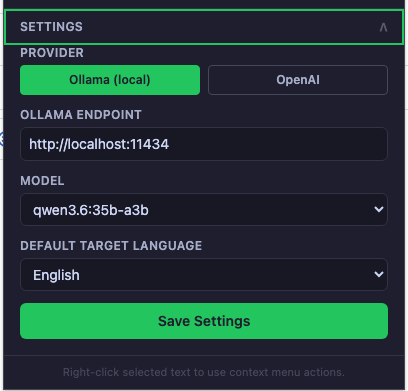
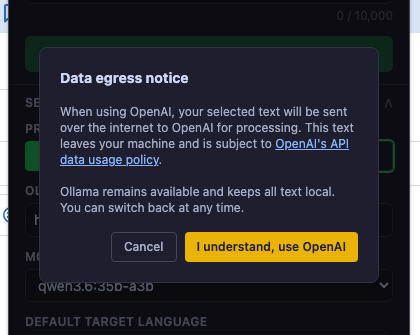
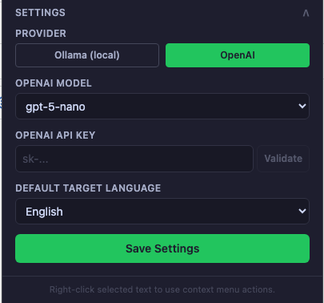
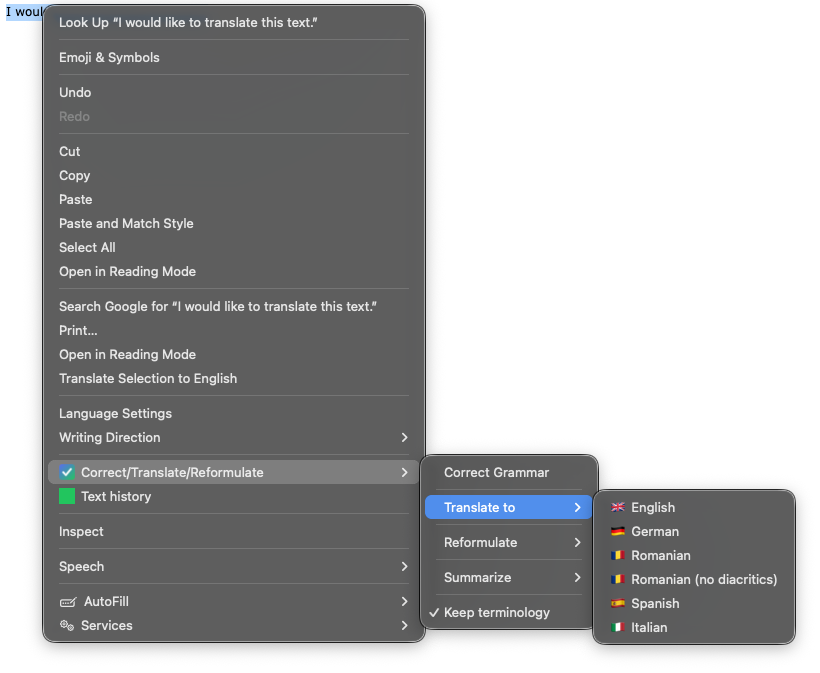
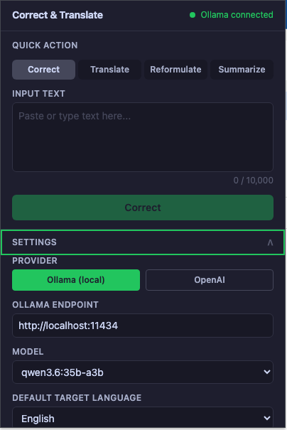
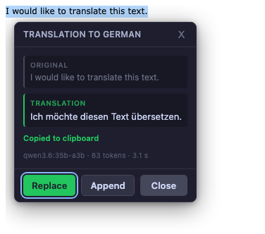

# User Guide — Correct & Translate

Correct & Translate corrects grammar, translates, reformulates, and summarizes
the text you select on any web page. It runs against a **local AI (Ollama)** by
default — so your text stays on your own computer — or, opt-in, against
**OpenAI**.

This guide walks through choosing a provider, running an action, and reading
the result. For installing the local AI or setting up an OpenAI key, see the
linked guides at the end.

---

## 1. The two providers at a glance

| Provider | Default | Where your text goes | Needs a key |
|----------|---------|----------------------|-------------|
| **Ollama (local)** | Yes | Your own computer — nothing leaves your machine | No |
| **OpenAI** | No (opt-in) | OpenAI's servers over the internet | Yes |

Start with **Ollama** if you want privacy. Use **OpenAI** only if you prefer not
to run a local model and accept that your text is sent to OpenAI.

---

## 2. Open Settings and pick your provider

Click the toolbar icon to open the popup, then expand **Settings**. The status
dot at the top shows whether the local AI is reachable (green = "Ollama
connected").

### Option A — Ollama (local, private)

Keep **Provider** set to **Ollama (local)**. Confirm the **Ollama endpoint**
(`http://localhost:11434` by default) and pick a **Model**. Click **Save
Settings**.

> First time? You need Ollama installed and running with a model pulled, and you
> must allow the extension's origin. See
> [Installing Ollama (macOS and Windows)](ollama-install-guide.md), which also
> explains which model fits your RAM.

### Option B — OpenAI (opt-in)

Set **Provider** to **OpenAI**. The first time you do this, a **Data egress
notice** appears, reminding you that your selected text will be sent over the
internet to OpenAI. Choose **I understand, use OpenAI** to continue, or
**Cancel** to stay on Ollama.

Then choose an **OpenAI Model** (`gpt-5-nano` or `gpt-5.4-nano`), paste your
**OpenAI API key**, optionally click **Validate**, and click **Save Settings**.
While OpenAI is active, a reminder is shown that your text leaves your machine.

> See [Using OpenAI: API key, budget limits, and alerts](openai-setup-guide.md)
> for how to create a key and cap your spending.

---

## 3. Run an action — two ways

### From the right-click context menu (on any page)

Select text on a page, right-click, and open **Correct / Translate /
Reformulate**. From there you can:

- **Correct Grammar** — fix grammar and spelling, keeping the original language.
- **Translate to** — English, German, Romanian, Romanian (no diacritics),
  Spanish, or Italian.
- **Reformulate** — rewrite in a tone (Keep / Professional / Friendly / Natural).
- **Summarize** — a Brief, Standard, or Detailed summary.
- **Keep terminology** — a toggle that tells the model to leave domain terms
  unchanged.

### From the popup (paste or type)

Open the popup, choose a **Quick Action** (Correct, Translate, Reformulate, or
Summarize), paste or type into **Input text**, and click the action button. The
result appears inline and is copied to your clipboard.

---

## 4. Read the result

For text inside an **editable field**, a floating result panel appears next to
your selection. It shows the **original** text, the **result**, a
"Copied to clipboard" confirmation, and a metadata line with the model, token
count, and elapsed time (for example `qwen3.6:35b-a3b · 83 tokens · 3.1 s`).

You can:

- **Replace** — swap your selection with the result in place.
- **Append** — add the result after your selection.
- **Close** — dismiss the panel (the result is already on your clipboard).

For non-editable text, the result is copied to your clipboard automatically so
you can paste it wherever you need.

---

## 5. Tips

- **Privacy:** with **Ollama (local)**, nothing you process ever leaves your
  computer. Switch to it any time from Settings.
- **Language is preserved:** Correct, Reformulate, and Summarize keep the input
  language — text is never silently translated. Use **Translate to** when you
  actually want another language.
- **Romanian, two ways:** choose **Romanian** for correct diacritics, or
  **Romanian (no diacritics)** for plain ASCII (legacy systems).
- **Input limit:** up to 10,000 characters per request.

---

## More

- [Installing Ollama (macOS and Windows)](ollama-install-guide.md)
- [Using OpenAI: API key, budget limits, and alerts](openai-setup-guide.md)
- [Provider setup and privacy reference](provider-setup-and-privacy.md)
- [Privacy policy](../PRIVACY.md)
